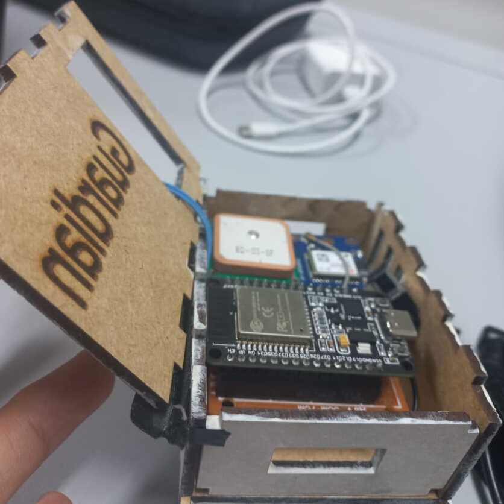

# Guardian

Aplicación móvil con geolocalización en tiempo real, conectada a un dispositivo IoT y automatizada mediante Node-RED.

---

## Características principales

- Geolocalización en tiempo real desde un módulo GPS conectado a ESP32
- Botón de emergencia que envía alertas automáticas
- Backend sin servidor usando Node-RED y Firebase
- Interfaz móvil construida con Jetpack Compose (Android)
- Autenticación de usuario (login y registro)
- Historial de ubicaciones almacenado en la nube
- Comunicación con altavoz remoto vía MQTT

---

## Tecnologías usadas

| Componente       | Tecnología                        |
|------------------|-----------------------------------|
| Frontend móvil   | Kotlin + Jetpack Compose          |
| Backend IoT      | ESP32 + GPS (NEO-6M)              |
| Comunicación     | MQTT (Mosquitto)                  |
| Automatización   | Node-RED + Firebase               |
| Almacenamiento   | Firebase Realtime Database        |

---

## Video funcionamiento + app movil

- [Ver demo](https://drive.google.com/file/d/1xDzt8mqWVasORswg8ScbutHSZfAeQOhm/view?usp=sharing)

---

## Dispositivo IOT / Flujo automatizado Node-red

---

## Informe y documentación

- [Informe técnico del proyecto](https://drive.google.com/file/d/1hJd60UWyFOhSU3GZ4q37ByGUJCWPzIIv/view?usp=sharing)
- [Presentación final (PDF)](https://drive.google.com/file/d/1IY1jpYNLZe4DnRCiNBd_g9QQTHAvcSog/view?usp=sharing)

---

## Autor

**Italo H.**  
[LinkedIn](https://linkedin.com/in/italo-huillca) · [Correo](mailto:huillca.italo@gmail.com)
